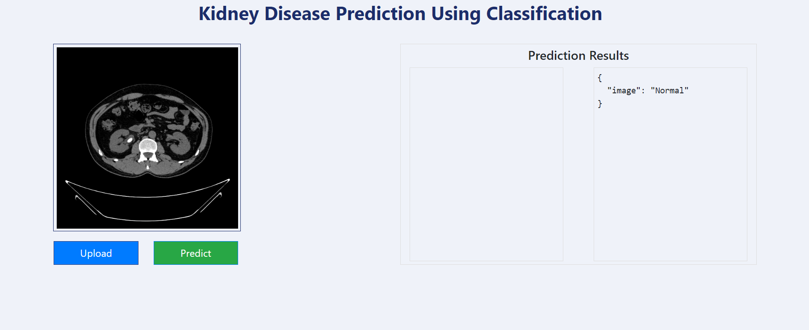

# E2E_Deep_Learning_Project_Kidney_Disease_Classifier

This project classifies the Kidney CT scan images into 4 different classes namely Crystal, Normal, Stone and Tumor.
We have use as DeepLearning Neural Network named Convolution Neural Network for Feature Extraction and Artificial Neural Network for classfication



## Workflows
Below mentioned is the process or flow of the updates that will happen in the project : 
1. Update config.yaml
2. Update secrets.yaml [Optional]
3. Update params.yaml
4. Update the entity
5. Update the configuration manager in src config
6. Update the components
7. Update the pipeline
8. Update the main.py
9. Update the dvc.yaml
10. app.py

## How to run?
## STEPS:
<b>Clone the repository</b>

https://github.com/girishSaiWork/E2E_Deep_Learning_Project_Kidney_Disease_Classifier <br>
<b>
STEP 01- Create a conda environment after opening the repository</b><br>
```bash
python -m venv venv

.\venv\Scripts\Activate.ps1
```
STEP 02- install the requirements
```bash
pip install -r requirements.txt
```
STEP 03- For necessary folder creation run the following python script
```bash
python template.py
```
## Data Collection
We have used the kaagle dataset from the following URL: <br>
https://www.kaggle.com/datasets/nazmul0087/ct-kidney-dataset-normal-cyst-tumor-and-stone<br>

1) We have used G-drive as the cloud storage or the source team from where we have e been treating as the source of our data.
2) Downloading the from G-drive and extracting the image data to the local for procesing

## Modeling
1) We used the python module splitfoders to create train, validation and test datasets.
2) Using the TensorFlows ImageDatagenerator we have created the associated the train, validation and test datasets and passed them to the model as input for training.
3) We have used the Conv2D for feature extraction and ANN for classification.

## Features
1) We used the DagsHub for managing the AI model<br>
Reference : https://dagshub.com
Run Dagshub related variables to export as env variables:
```bash
export MLFLOW_TRACKING_URI=https://dagshub.com/girishSaiWork/Kidney-Disease-Classification-MLflow-DVC.mlflow
export MLFLOW_TRACKING_USERNAME= username
export MLFLOW_TRACKING_PASSWORD= password
```

2) MLFlow for tracking the changes in the model<br>
Reference : https://mlflow.org/docs/latest/index.html
3) For Data Version Control( which can track the changes in the data, it will skip running the stages in the Project flow if there are no changes).<br>
Reference : https://dvc.org/doc
Run the DVC commands in the project to track the changes in the data in windows terminal(cmd) or git bash terminal<br>
```bash
dvc init
dvc repro
dvc dag
```

